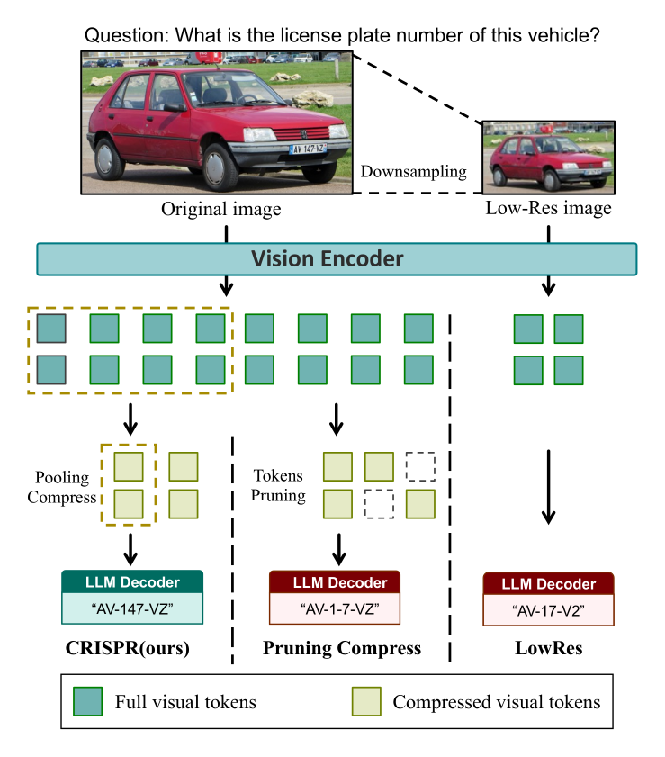
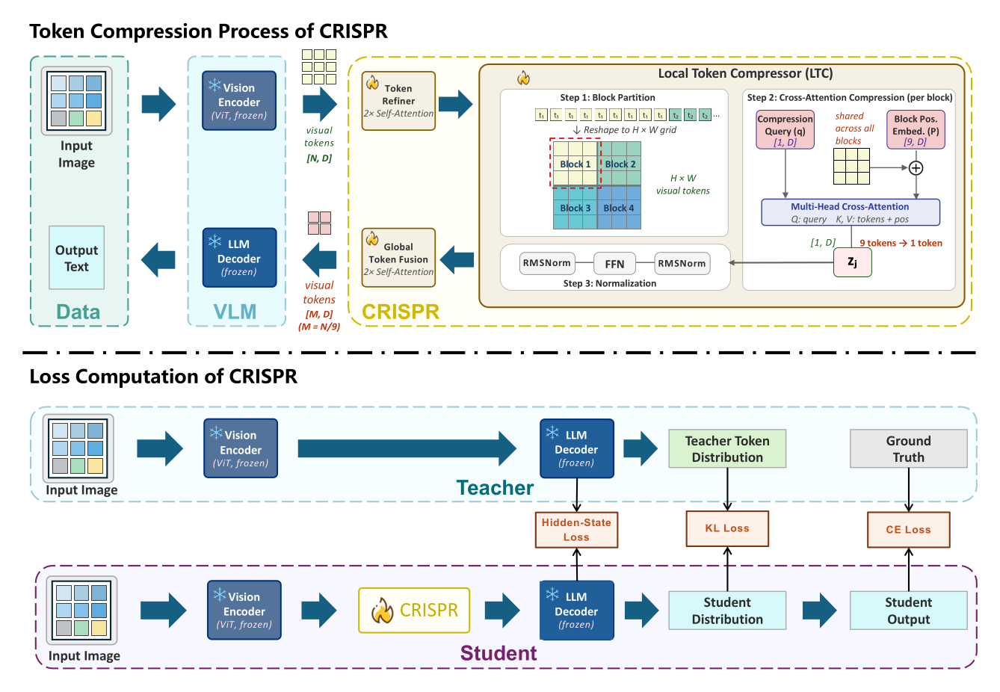

<div align="center">

# CRISPR

### Context-Refined Information Spatial Pooling with Region-awareness for Efficient Visual Token Compression in VLMs

[](https://doi.org/10.1145/3767308.3835007)
[](https://doi.org/10.1145/3767308.3835007)
[](https://huggingface.co/Rim2000/CRISPR)
[](LICENSE)
[](https://www.python.org/)

Official repository for our ACM MM 2026 paper, accepted for publication.

**[Abstract](#abstract) · [Code](#code) · [Reproduction](#reproduction) · [Checkpoints](#checkpoints) · [Citation](#citation)**

</div>

---

## Abstract

CRISPR is a visual token compression method for Vision-Language Models (VLMs).
It achieves 9x/16x token compression via 3x3 block cross-attention, distilled
from a frozen Qwen2.5-VL-7B/3B-Instruct teacher, with trainable parameters
amounting to roughly 0.1% of the 7B backbone.

<!-- TODO(camera-ready): paste final paper abstract here -->

<p align="center">
  
</p>

<p align="center"><sub>Comparison of compression methods. Token pruning and resolution downsampling lose fine-grained details, whereas CRISPR preserves them.</sub></p>

<p align="center">
  
</p>

<p align="center"><sub>CRISPR architecture: Token Refiner → Local Token Compressor (block cross-attention) → Global Token Fusion, trained via CE + KL + hidden-state distillation from a frozen Qwen2.5-VL teacher.</sub></p>

---

## Code

```bash
pip install -r requirements.txt
```

```python
from crispr import create_model_v7

model = create_model_v7(decoder_path="./Qwen/Qwen2.5-VL-7B-Instruct")
```

- `crispr/model_v7.py` — the CRISPR architecture: `TokenMixer` (Token Refiner),
  `LocalC3` (Local Token Compressor + Global Token Fusion), and the top-level
  `ImageC3ModelV7` model that wires them around a frozen Qwen2.5-VL decoder.
- `crispr/dataset.py`, `crispr/dataset_v3.py` — dataset loaders for training.
- `train_crispr_v7.py` — the training script (see docstring for stage-by-stage
  usage: Stage-1a/1b/2/3).
- `scripts/eval_crisp.py`, `scripts/eval_9x_quick.py` — evaluation scripts for
  CRISPR / teacher / low-resolution baselines.

**Not included:** the VisionZip / PruMerge+ / FastV baseline comparison code
used in the paper was ported from [EffiVLM-Bench](https://github.com/EffiVLM-Bench/EffiVLM-Bench),
whose repository declares no license (all rights reserved by default), so we
removed it rather than redistribute it without permission — see
[NOTICE.md](NOTICE.md). To reproduce those baseline numbers, get the code
directly from EffiVLM-Bench and adapt it to Qwen2.5-VL as described there.

---

## Reproduction

### Environment

- Python 3.12, PyTorch 2.10+ (cu128), `transformers>=4.56.1` (see `requirements.txt`)
- Download the backbone weights and point `--decoder_path` at them:
  - `./Qwen/Qwen2.5-VL-7B-Instruct` or `./Qwen/Qwen2.5-VL-3B-Instruct`, from
    [Qwen2.5-VL](https://github.com/QwenLM/Qwen2.5-VL) (e.g. via
    `huggingface-cli download Qwen/Qwen2.5-VL-7B-Instruct --local-dir ./Qwen/Qwen2.5-VL-7B-Instruct`)
  - If `huggingface.co` is unreachable, set `HF_ENDPOINT=https://hf-mirror.com`
    before downloading/running (both `train_crispr_v7.py` and the eval scripts
    already set this as a default if unset).
- `attn_implementation="eager"` is required — SDPA is not compatible with the
  custom `inputs_embeds`/3D position_ids used here.

### Data preparation

Training data is a JSONL file, one example per line:

```json
{"id": "unique_id", "image": "path/to/image.jpg", "conversations": [{"role": "user", "content": "question"}, {"role": "assistant", "content": "answer"}], "source": "dataset_name"}
```

The `source` field is used to auto-select a task-specific prompt template
(e.g. OCR-style datasets get a specialized prompt) — see `MultiTaskDataset`
in `train_crispr_v7.py`. Evaluation datasets are expected under `--data_root`
(default `./data/eval`) in the layout each `load_*` function in
`scripts/eval_crisp.py` / `scripts/eval_9x_quick.py` expects (grep for
`def load_<dataset>` to see the exact file/column names for a given dataset).

### Training

`local_c3_block_size` sets the compression ratio: `3` → 9x (3×3 blocks), `4` → 16x (4×4 blocks).

```bash
# Stage-1a: warm up LocalC3 only, TokenMixer frozen
python3.12 train_crispr_v7.py \
    --data_path ./data/train/stage1_caption/combined.jsonl \
    --output_dir ./outputs/crispr_9x_stage1a \
    --decoder_path ./Qwen/Qwen2.5-VL-7B-Instruct \
    --local_c3_block_size 3 \
    --epochs 1 --freeze_token_mixer --use_hidden_distillation

# Stage-1b: train TokenMixer + LocalC3 jointly
python3.12 train_crispr_v7.py \
    --data_path ./data/train/stage2_mixed/combined_v4.jsonl \
    --output_dir ./outputs/crispr_9x_stage1b \
    --decoder_path ./Qwen/Qwen2.5-VL-7B-Instruct \
    --local_c3_block_size 3 \
    --epochs 3 \
    --resume_from ./outputs/crispr_9x_stage1a/checkpoint-best \
    --use_hidden_distillation

# Stage-2: multi-GPU, + hidden-state distillation schedule, + 3D RoPE alignment
torchrun --nproc_per_node=4 --master_port=29501 train_crispr_v7.py \
    --data_path ./data/train/stage2_mixed/combined_v4.jsonl \
    --output_dir ./outputs/crispr_9x_stage2 \
    --decoder_path ./Qwen/Qwen2.5-VL-7B-Instruct \
    --local_c3_block_size 3 \
    --epochs 3 --batch_size 1 --gradient_accumulation_steps 16 \
    --lr_local_c3 1e-5 --lr_token_mixer 1e-5 \
    --resume_from ./outputs/crispr_9x_stage1b/checkpoint-best \
    --use_hidden_distillation --hidden_loss_weight 0.1 --hidden_loss_weight_final 0.3

# Resume with full trainer state (weights + optimizer + epoch) after a crash
torchrun --nproc_per_node=4 train_crispr_v7.py \
    --resume_training_from ./outputs/crispr_9x_stage2/checkpoint-step_XXXX \
    ...  # same args as the run being resumed
```

For 16x, pass `--local_c3_block_size 4` and `--decoder_path` for the 3B
backbone if reproducing that configuration; per-module learning rates default
to `--lr_local_c3 1e-4`, `--lr_token_mixer 5e-5`, `--lr_decoder_lora 1e-5`
(AdamW, linear warmup + decay, grad clip 1.0). Loss is
`CE + 0.5·KL(T=1.0) + hidden_weight·Hidden(MSE on last decoder layers)`,
with `hidden_weight` scheduled linearly from `--hidden_loss_weight` to
`--hidden_loss_weight_final` across training.

### Evaluation

```bash
# CRISPR, 7B backbone, 9x — full benchmark suite
CUDA_VISIBLE_DEVICES=0,1,2,3 python3.12 scripts/eval_crisp.py \
    --methods image_c3 \
    --decoder_path ./Qwen/Qwen2.5-VL-7B-Instruct \
    --image_c3_ckpt ./outputs/crispr_9x_stage2/checkpoint-best \
    --block_size 3 \
    --datasets mmmu mmbench chartqa docvqa textvqa realworldqa mathvista ocrbench mme scienceqa \
    --n 0 --output_dir eval_results/crisp/9x

# CRISPR, 3B backbone, 9x
python3.12 scripts/eval_crisp.py \
    --methods image_c3 \
    --decoder_path ./Qwen/Qwen2.5-VL-3B-Instruct \
    --image_c3_ckpt ./outputs/crispr_3b_9x/checkpoint-best \
    --block_size 3 \
    --datasets mmmu mmbench chartqa docvqa textvqa mme scienceqa \
    --n 0 --output_dir eval_results/crisp/3b_9x

# Teacher (uncompressed upper bound) and LowRes baseline use the same script
python3.12 scripts/eval_crisp.py --methods teacher lowres \
    --datasets mmmu mmbench chartqa --n 0 --output_dir eval_results/reference
```

`--n 0` evaluates the full dataset; use a smaller `--n` for a quick sanity
check. Results land at `eval_results/{method}/{ratio}/{dataset}/results.json`.
See each script's module docstring for the complete dataset list and more
usage examples (`scripts/eval_9x_quick.py` is an earlier, 9x/7B-only variant
of the same evaluation logic kept for reference).

Note: to reproduce the VisionZip/PruMerge+/FastV baseline numbers reported in
the paper, see the note in [Code](#code) above regarding EffiVLM-Bench.

---

## Checkpoints

CRISPR checkpoints are hosted on Hugging Face: **[Rim2000/CRISPR](https://huggingface.co/Rim2000/CRISPR)**.

| Backbone | Compression | File |
|---|:---:|---|
| Qwen2.5-VL-3B-Instruct | 9x  | [`3b_9x/checkpoint.pt`](https://huggingface.co/Rim2000/CRISPR/tree/main/3b_9x) |
| Qwen2.5-VL-3B-Instruct | 16x | [`3b_16x/checkpoint.pt`](https://huggingface.co/Rim2000/CRISPR/tree/main/3b_16x) |
| Qwen2.5-VL-7B-Instruct | 16x | [`7b_16x/checkpoint.pt`](https://huggingface.co/Rim2000/CRISPR/tree/main/7b_16x) |

---

## Citation

If you find this work useful, please cite:

**ACM Reference Format:**

Zuyi Zhou, Dizhan Xue, Shengsheng Qian, and Changsheng Xu. 2026. CRISPR:
Context-Refined Information Spatial Pooling with Region-awareness for
Efficient Visual Token Compression in VLMs. In Proceedings of the 34th ACM
International Conference on Multimedia (MM '26), November 10-14, 2026, Rio
de Janeiro, Brazil. ACM, New York, NY, USA. https://doi.org/10.1145/3767308.3835007

**BibTeX:**

```bibtex
@inproceedings{zhou2026crispr,
  author    = {Zhou, Zuyi and Xue, Dizhan and Qian, Shengsheng and Xu, Changsheng},
  title     = {CRISPR: Context-Refined Information Spatial Pooling with
               Region-awareness for Efficient Visual Token Compression in VLMs},
  booktitle = {Proceedings of the 34th ACM International Conference on
               Multimedia (MM '26)},
  year      = {2026},
  publisher = {Association for Computing Machinery},
  address   = {New York, NY, USA},
  doi       = {10.1145/3767308.3835007}
}
```

---

## Authors & Affiliations

| | | |
|---|---|---|
| **Zuyi Zhou** | <zuyi.zhou@evermind.ai> | IA, CAS · UCAS · EverMind AI |
| **Dizhan Xue** | <dizhan.xue@evermind.ai> | IA, CAS · UCAS · EverMind AI |
| **Shengsheng Qian** \* | <shengsheng.qian@nlpr.ia.ac.cn> | IA, CAS · UCAS |
| **Changsheng Xu** | <csxu@nlpr.ia.ac.cn> | IA, CAS · UCAS · Peng Cheng Laboratory |

<sub>\* Corresponding author · IA, CAS = Institute of Automation, Chinese Academy of Sciences · UCAS = University of Chinese Academy of Sciences</sub>

---

<sub>

**Naming.** The paper uses **CRISPR** as the method name. Some historical code/comments may still refer to the earlier internal codename **CRISP** / **ImageC3** — these refer to the same method.

**License.** Code in this repository is released under the [MIT License](LICENSE), unless otherwise noted in individual files or subdirectories (e.g. third-party assets with their own upstream licenses). See [NOTICE.md](NOTICE.md) for a note on baseline-comparison code that was removed rather than redistributed without a confirmed license.

**Acknowledgements.** This work builds on [Qwen2.5-VL](https://github.com/QwenLM/Qwen2.5-VL). We thank the authors of Qwen2.5-VL and the datasets used in this work.

</sub>
